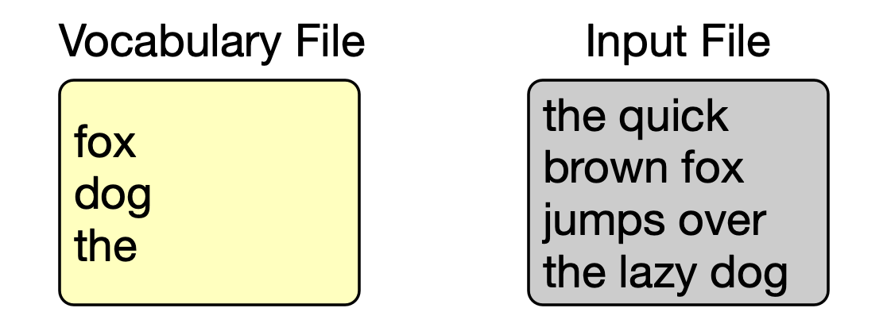
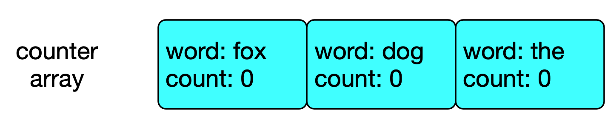
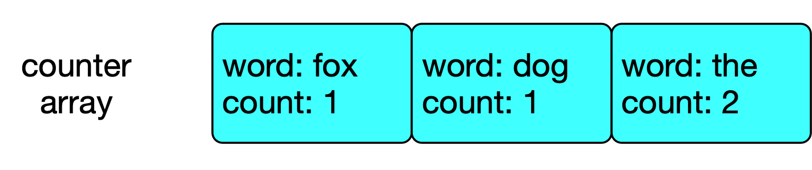
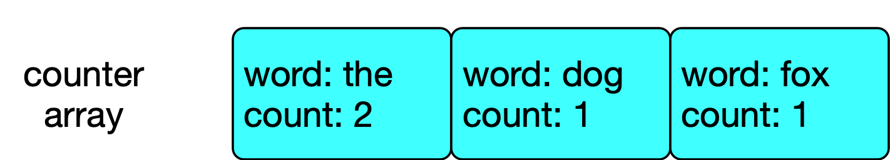

# Programming Assignment IV

*Last modified: 07/04/2021 at 5:30PM*

## Goals

Your goals in this assignments are:

* To build famliarity with using structs,
* To learn how to setup your own Makefile,
* To learn how to design your own unit test suite,
* To learn about dynamic memory and how to use `malloc`/`free`.

## Structure

The structure of the code for this assignment is as follows:

* `src`: count.c contains four functions you need to implement. count.h contains
        the declarations for the functions in count.c, as well as the declaration for the `WordCount`
        struct. You'll want to refer to this file often since you will be using this structure in your code.
        The main.c file contains template code that you can use and modify to do some quick testing of your
        code. Thorough testing should be implemented and maintained inside of your unit test files.

* `tests`:  there are three unit testing files, one for each of the functions you have to implement excluding
            `free_count_array` (since there isn't much in the way of testing that). The unit testing files as
            given to you are just skeleton files. We are getting to the point were you are expected to build
            your own testing suite for the assignments.

## Background

### Structs

This assignment requires you to work with a very basic C struct. Use this assignment as a way to get familiar with that.
Future assignments will make much more complex use of structures.

### Dynamic Memory Allocation

Memory allocation is a process by which computer programs and services are
assigned with physical or virtual memory space.
In general, the memory is allocated either statically (at compile time by declaring variables),
or dynamically (at runtime by calling `malloc()` and `free()`).
See [this page](https://www.gnu.org/software/libc/manual/html_node/Memory-Allocation-and-C.html#Dynamic-Memory-Allocation)
for more information on C memory allocation.

## Requirements

This homework requires you to count word frequencies of a input file,
and print the word frequencies in descending order.
Which words to count is specified by a "vocabulary" file.
See the following example:

1. Assume the following vocabulary file and input file:

    <p align="center">
        
    </p>

1. Create an array of `WordCount`s
(referred to as "counter array" in the rest of this document)
according to the vocab file:

    <p align="center">
        
    </p>

1. Then, look at each word in the input file.
If the word exists in the counter array, increment its corresponding counter.
Eventually, the counter will look like:

    <p align="center">
        
    </p>

1. Sort the counter array by its count.
It two words have the same count, the alphabetically smaller word should go before.

    <p align="center">
        
    </p>

1. Now that the counter array is sorted, print each word and its count:
    ```
    the 2
    dog 1
    fox 1
    ```

You need to implement the following functions:

| Function | Input | Output/Effect |
|-|-|-|
| `alloc_count_array()` | - `char *vocabFile`: path to a vocabulary file (input)<br>- `WordCount **countArray`: pointer to a `WordCount *` variable that will hold the newly created counter array (output)<br>- `int *size`: pointer to an `int` that will hold the length of the counter array (output) | - Read the vocabulary file, assuming each line is a word. You can assume there is no duplicate words in the vocabulary file.<br>- Allocate a `WordCount` array with length equal to the number of words in the vocabulary. The array elements correspond to words in the vocabulary, in the order they appear in the vocabulary file.<br>- For each `WordCount` array element, its `word` field should hold the corresponding word, and its `count` field should be initialized to 0.- Assign the newly created array to `*countArray` , and assign the array's length to `*size`.<br>- Return `false` if anything fails. Otherwise, return `true`. |
| `count_words_from_file()` | - `char *inputFile`: path to a file<br>- `WordCount *countArray`: a counter array used to store the word counting results. You can assume all counters are initialized to 0. | - Read each word in the `input_file`. Note that the file might have multiple lines.<br>- For each word, if the word is in the counter array, increment its corresponding count by 1.<br>- The counter is case sensitive, e.g. you can assume "Hello" and "hello" are two different words. Words will not span across lines.<br>- Return `false` if anything fails. Otherwise, return `true`. |
| `print_words_descending_freq()` | - `WordCount *countArray`: a counter array containing word count results | - Print each word and its count in decreasing count order. For words that have the same count, the alphabetically smaller word should go before.<br>- Each line should correspond to a word and look like `<word> <count>`.<br>- Return `false` if anything fails. Otherwise, return `true`.<br>(Hint: think about using `qsort()` like you did in PA03) |
| `free_count_array()` | - `WordCount *countArray`: a counter array to be freed | - Free the memory of `countArray`<br>- Return `false` if anything fails. Otherwise, return `true`. |


## Compiling and Linking

You should adapt the example Makefile template on Brightspace to compile and run your code. Make sure
the appropriate warning and error flags (`-Wall -Wextra -Wvla -Werror`) are included in your compilation commands.
Also, remember that you must remove `-Wvla` from the compilation command to be able to compile unit testing files.

Not using a Makefile to automate compiling and running code will be your doom. If it isn't as easy as running
a single command to run unit tests, you will soon find yourself not running unit tests often enough. It's 
human nature. You must automate this process, and constantly give yourself feedback on your code.

## Testing

We have provided only the skeletons for the unit testing files. You must write your unit tests
in these files.

## Grading

As in previous programming assignments, we are grading you mainly on the functionality of your code.
However, on top of that, we will check your code for memory errors (using valgrind). You will lose
some amount of points for each memory error that your code produces and valgrind catches. Refer to
lecture and additional material on Brightspace for the full grading policy concerning memory errors.

## Submission

Navigate to the src directory where you `count.c` file is, and compress it with:

```
zip count.zip count.c
```

Then, upload the zip file to Brightspace in the appropriate submission box.
