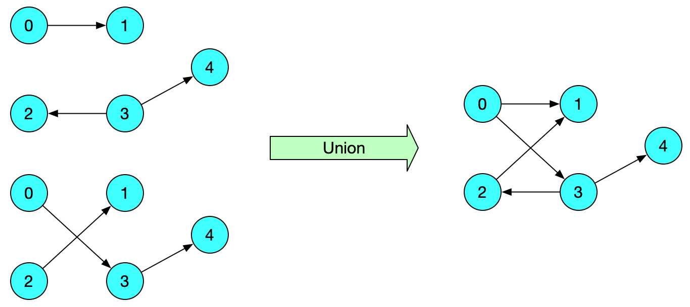

# Programming Assignment V

*Last modified: 07/10/2021 at 10:00PM*

## Goals

* To become adept at writing programs that handle several dijoint structures,
* To become adept at parsing input files to read in data into programs,
* To gently introduce the concept of graphs in computer science.

## Background

In computer science, a graph is a data structure consisting of nodes (or vertices, used interchangeably in this context) and edges.
Originally, graphs are mathematical objects used to represent physical entities or ideas (e.g. a network of roads, a set of 'friendships' on Facebook, etc.).
We are **very** often interested in writing programs that process such data. There are many ways to represent a graph in computer memory. For this assignment,
we choose to represent graphs using adjacency matrices, which are very convenient to handle in code, but are not space efficient for most applications.

### Graph Representation in Computer Memory

Graphs are commonly represented in two alternative ways: *adjacency list* and *adjacency matrix*.
In this assignment, we are going to use the **adjacency matrix** representation.
An adjacency matrix is a 2D array of size `V x V` where `V` is the number of nodes in the graph.
In order to represent the graph in memory, we will assign each node in the graph with an integer, starting
with zero.
If we let the adjacency matrix be the 2D array `adj[][]` in a C program, then
the entry `adj[i][j] == 1` indicates that there is an edge from node labelled`i` to node labelled `j`,
and `adj[i][j] == 0` indicates that no edge exist between node `i` and node `j`.

For example, the follow graph has 5 nodes and 5 edges, and it's adjacency matrix is a 5x5 matrix:

<p align="center">
  
</p>

You can easily imagine that this graph could represent the network of train routes between five cities,
where we had to assign an integer label for each city (e.g. 0 for Shanghai, 1 for Chengdu, etc.). The 
adjacency matrix is 5 x 5 since there are exactly 25 pairs of nodes (allowing pairs with identical source
and target nodes). Each entry is either 0 (no train route between the two cities), or 1 (a train route exists).

For this assignment, you will be using the following structure to represent graphs using an adjacency matrix:

```c
typedef struct _graph {
  int numVertices;
  int **adjMatrix;
} Graph;
```

where `numVertices` is the number of vertices/nodes in the graph, also equivalent to the width and length of the adjacency matrix.
`adjMatrix` is the adjacency matrix itself. Note that it is a double pointer. Indeed, `adjMatrix` is an array on the heap of integer pointers
`adjMatrix[i]`, each of which are arrays of integers themselves. To be more precise, each `adjMatrix[i]` is an array of integers, either zeros or
ones, that stores the data corresponding to one row of the adjacency matrix. Taking all `adjMatrix[i]` together gives us the whole adjancency
matrix.


### Graph Representation in Files

The graph representation given above works well for representing graphs inside of computer memory (using structures). However,
we also need a way to represent graphs in files. When a program needs to process a graph, it will open the file representation of
that graph and read it into memory (as described above). Of course, programs will also often need to be able to write a graph
in memory out to a file. For this assignment, we shall use the following format:

```
# Comment
<No. nodes> # Comment
<edge_0_source> <edge_0_target>
<edge_1_source> <edge_1_target>
...
```

Comments work just like Python or C comments: use `#` to indicate the start of a comment. They can appear on their own line or not. Either way, whatever comes after the `#` until the end of that line is considered to be part of the comment.
Blank lines are allowed in the file.
The first line that isn't a comment line or a blank line contains the number of nodes in the graph. There may any number of white-spaces before or after that. There may a comment after that.
Any line that isn't a comment line or a blank line after the first contains an edge in the graph. Each edge consists of two integer labels, the first one being he source node, the second being the target node, separated by any number of white-spaces other than a newline. The edge may be followed by a comment.
Node labels take value from 0 to V - 1 in a sequence (no integer may be skipped).
**Edges are listed in a specific order:** edges are sorted in ascending order according to the source node labels first, and the target node labels second.

For example, the graph in the previous example could be represented in a file as:

```
# Sample graph
5 # The number of nodes in the graph.

0 1 # First edge,
0 3 # second edge,
2 1 # etc.
3 2
3 4
```

### Transpose Graph

Transposing a graph means inverting all of its edges. For example, edge a->b should be inverted to b->a:

<p align="center">
  
</p>

### Combining Graphs (Union of two graphs)

Given two graphs `A` and `B` with the same set of nodes, combining the two graphs means producing a new graph, where there's an edge i->j, if edge i->j exists in at least one of `A` or `B`:

<p align="center">
  
</p>

That's all you need to know about the graphs for this homework. For more information regarding graphs, [this excellent textbook has a section on graphs](https://algs4.cs.princeton.edu/40graphs/).

## Requirements

You need to implement the following functions:

| Function | Input | Description |
|-|-|-|
| `read_graph_from_file()` | - `char *filename`: filename/path to the valid input graph file. | This function reads in a graph from a file into a graph structure, essentially converting from one representation to the other. See the comment in graph.c for the details. |
| `write_graph_to_file()` | - `char *filename`: filename/path to the output file.<br>- `Graph const *graph`: a pointer to the graph structure to be written out to the output file. | This function write out a file from a `Graph` structure in memory to a file. See the comment in graph.c for the details. |
| `transpose_graph()` | - `Graph *graph`: a pointer to the graph to be transposed | This function should transpose the input graph. See the comment in graph.c for the details. |
| `combine_graph()` | - `Graph *first`: pointer to the first graph. <br>- `Graph *second`: pointer to the second graph. | Combine two graphs into a new one. See the comment in graph.c for the details. |

## Compiling and Linking

You should adapt the example Makefile template on Brightspace to compile and run your code. Make sure the usual warning flags are used for compilation.

## Testing

You should write a unit testing suite for each of the required function following the example set by previous programming assignments.

## Submission

Navigate to the src directory where you `graph.c` file is, and compress it with:

```
zip graph.zip graph.c
```

Then, upload the zip file to Brightspace in the appropriate submission box.
